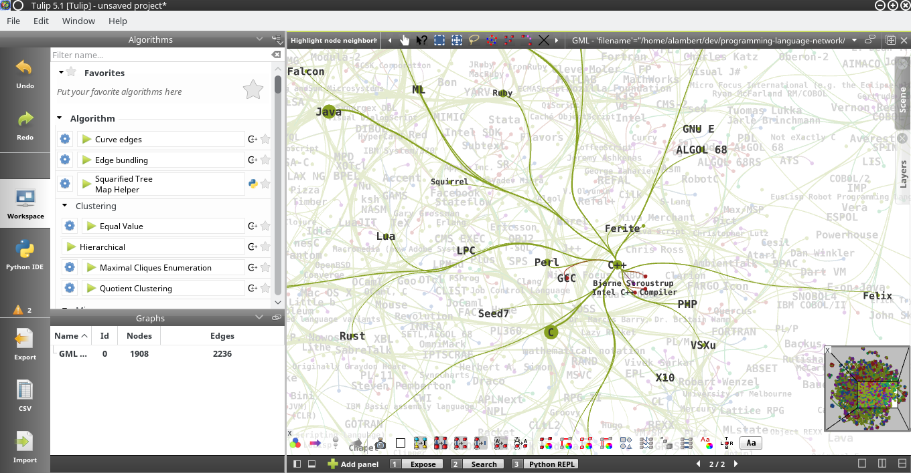
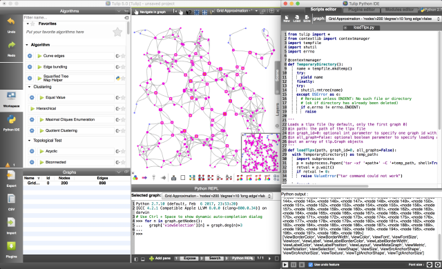
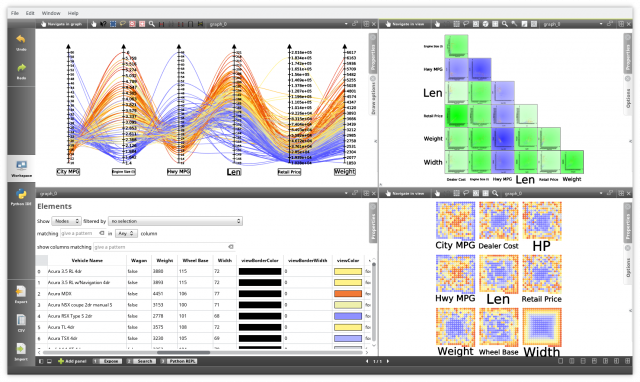

# Tulip     

[Tulip](https://tulip.labri.fr) is an open source, cross-platform, data visualization framework mainly dedicated to the analysis, 
the drawing and the visualization of very large graphs (up to the million of nodes and edges).
It has been created by [David Auber](https://www.labri.fr/perso/auber/david_auber_home_page/),
from [LaBRI](https://www.labri.fr/) (Laboratoire Bordelais de Recherche en Informatique) and [University of Bordeaux](https://www.u-bordeaux.fr/),
and maintained over the years by an average size development team.
Until the 5.1 release, the main Tulip code repository (subversion based) was hosted 
on [SourceForge](https://sourceforge.net/projects/auber/).
That repository remains the Tulip releases download repository but Tulip 6 development are now hosted here.

## Overview

Tulip is an information visualization framework dedicated to the analysis and visualization of 
relational data. Tulip aims to provide the developer with a complete library, supporting the design 
of interactive information visualization applications for relational data that can be tailored to 
the problems he or she is addressing.

Written in C++ the framework enables the development of algorithms, visual encoding,
interaction techniques, data models, and domain-specific visualizations. One of the goal 
of Tulip is to facilitates the reuse of components and allows the developers to focus on 
programming their application. This development pipeline makes the framework efficient 
for research prototyping as well as the development of end-user applications.

## Features

The Tulip framework offers numerous features, notably:

  * An efficient graph data model in terms of memory usage for storing large networks and 
  the attributes of their elements (called properties in the Tulip semantics).
  It is also one of the few that offer the possibility to efficiently define and navigate 
  graph hierarchies or cluster trees (nested subgraphs).
  
  * Several graph file formats for serializing such a model to disk, notably the 
  [TLP format](https://tulip.labri.fr/site/?q=tlp-file-format) based on a
  Lisp syntax for easy parsing but also the TLP binary format for faster graph 
  saving and loading.
  
  * A large variety of graphs algorithms: clustering, metric, layout ... As Tulip is dedicated
  to graph visualization, it is provided with numerous state of the art graph layout algorithms
  but also a bridge to the [Open Graph Drawing Framework](http://www.ogdf.net).
  
  * A hardware accelerated graph rendering engine written in [OpenGL](https://www.opengl.org), 
  highly customizable in terms of visual encoding for graph nodes and edges, in order to 
  efficiently generate aesthetic and interactive visualizations.
  
  * Multiple visualization components (called views in the Tulip semantics) for analyzing graph data
  using other representations than the classical node-link diagram one: matrix, histograms,
  scatter plots, parallel coordinates, ...
  
  * [Python](https://www.python.org) bindings for the main Tulip C++ API, giving to Tulip scripting 
  facilities for manipulating graphs loaded from its main graphical user interface.
  The bindings can also be obtained from the [Python Packaging Index](https://pypi.python.org/pypi/tulip-python).
  
  * A plugin based architecture for easily extend the capability of the framework with new
  graph import mechanisms, graph algorithms, visualization components, ...
  Tulip plugins can be written in C++ or Python.
    
  * A graphical user interface, based on the [Qt](https://www.qt.io) framework, enabling to
  easily interact and manipulate the different components of the framework.

  
  

  
## Documentation

Below are some links to relevant documentation resources about the Tulip framework:

  * [Tulip User Manual](https://tulip.labri.fr/Documentation/current/tulip-user/html/index.html)
  * [Tulip Developer Handbook](https://tulip.labri.fr/Documentation/current/tulip-dev/html/index.html)
  * [Tulip C++ API](https://tulip.labri.fr/Documentation/current/doxygen/html/index.html)
  * [Tulip Python](https://tulip.labri.fr/Documentation/current/tulip-python/html/index.html)
  
## Installing Tulip

Tulip is a cross-platform framework and can be installed or compiled on many **Linux** distributions (Arch Linux, Debian, Fedora, Gentoo, OpenSUSE, Ubuntu...), on **MacOS** and **Windows**.

### Precompiled binaries

For each release, Tulip offers precompiled binaries for Linux (using [AppImage](https://github.com/AppImage/AppImageKit)), 
MacOS (dmg bundles) or Windows ([NSIS](http://nsis.sourceforge.net/Main_Page) based installers).
You can download those binaries from [SourceForge](https://sourceforge.net/projects/auber/files/tulip/).

### Compiling from scratch

Tulip can be easily compiled on every supported platforms. However, that process can take some times
depending on your system configuration.

The following dependencies are required to build Tulip:

  * [CMake](https://cmake.org) >= 3.22
  * A [C++17](https://en.wikipedia.org/wiki/C%2B%2B11) compiler : [GCC](https://gcc.gnu.org/) >= 8.0,
  [Clang](https://clang.llvm.org/) >= 5.0 or 
  [Microsoft Visual Studio](https://www.visualstudio.com/) >= 2017
  * [FreeType](https://www.freetype.org) 
  * [zlib](http://zlib.net)
  * [Qt](https://www.qt.io) >= 5.15
  * [OpenGL](https://www.opengl.org) >= 2.0
  * [GLEW](http://glew.sourceforge.net/) >= 1.4
  * [Python](https://www.python.org) >= 3.9
  * [Pip] (https://pypi.org/project/pip/)
  * [SIP](https://www.riverbankcomputing.com/software/sip/) >= 6.8.5 (to be installed via pip or on Debian/Ubuntu packages sipbuild and sip-tools)
  * [libzip](https://libzip.org)
  * [Qhull](http://www.qhull.org/)
  * [yajl](https://lloyd.github.io/yajl/) >= 2.0  
  
In order to generate the documentation, the following tools must be installed:

  * [Sphinx](http://www.sphinx-doc.org/en/stable/) to build the [User Manual](https://tulip.labri.fr/Documentation/current/tulip-user/html/index.html), [Developer Handbook](https://tulip.labri.fr/Documentation/current/tulip-dev/html/index.html) and [Python bindings documentation](https://tulip.labri.fr/Documentation/current/tulip-python/html/index.html)
  * [Doxygen](http://www.stack.nl/~dimitri/doxygen/) to build the [C++ API documentation](https://tulip.labri.fr/Documentation/current/doxygen/html/index.html)

If you are a Linux user, all these dependencies can be installed with the package manager of your distribution. The old continuous integration setup file [.travis.yml](travis.yml) can give you some hints for Tulip build on Linux platforms.

If you are a MacOS user, we recommend to use [MacPorts](https://www.macports.org/) or [Homebrew](https://brew.sh/) in order to easily install all these dependencies. Hints on how to build Tulip for these two environments can also be found in the old continuous integration setup file [.travis.yml](travis.yml). A dedicated script is also available for MacPorts [macports_build.sh](bundlers/mac/macports_build.sh).

If you are a Windows user, we recommend to use the UCRT version of [MSYS2](http://www.msys2.org/) as it greatly facilitates the build of Tulip on
that platform (notably by providing up to date compilers and precompiled dependencies). A dedicated batch file [msys2_build.bat](bundlers/win/msys2_build.bat) is available for MSYS2 build.

Hints on how to build Tulip for MSVC can be found in [appveyor_msvc.bat](appveyor_msvc.bat) currently used for continuous integration on [AppVeyor](https://www.appveyor.com/).

## References

 [Tulip web site](https://tulip.labri.fr) has a dedicated page for [Tulip bibliography](https://tulip.labri.fr/site/?q=tulip-biblio).

## License

Tulip is free software; you can redistribute it and/or modify
it under the terms of the GNU Lesser General Public License
as published by the Free Software Foundation, either version 3
of the License, or (at your option) any later version.

Tulip is distributed in the hope that it will be useful,
but WITHOUT ANY WARRANTY; without even the implied warranty of
MERCHANTABILITY or FITNESS FOR A PARTICULAR PURPOSE.
See the GNU Lesser General Public License for more details.
